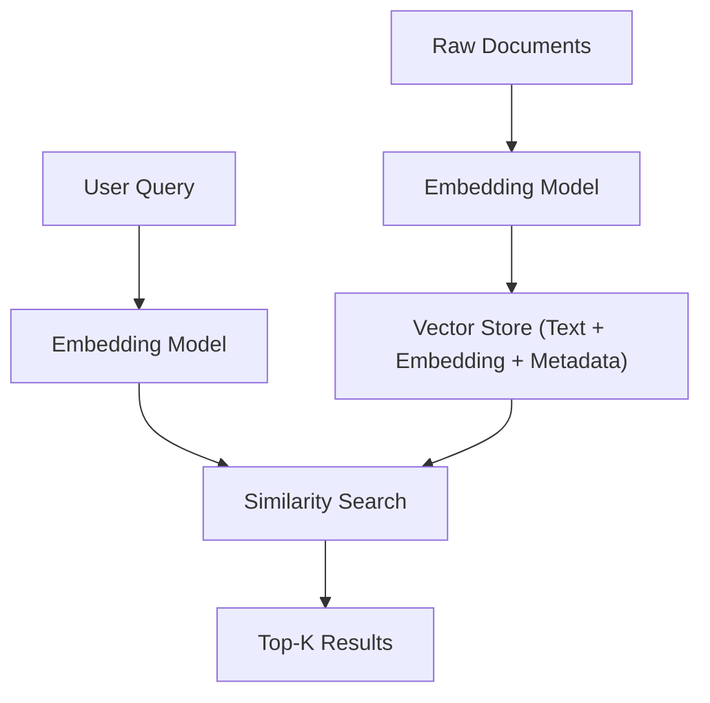

# Vector Store Example Series

This series of Python scripts demonstrates how to use vector stores for semantic search and retrieval, progressing from basic to advanced techniques. All examples use open-source models (e.g., SentenceTransformers) and are self-contained.

---

## Vector Store Concepts

- **Vector Store**: A data structure that stores text (or other data) alongside its vector embedding, enabling similarity search.
- **Embedding**: A numerical representation of text, generated by a model (e.g., SentenceTransformers).
- **Similarity Search**: Finding the most similar documents to a query by comparing their embeddings (using cosine similarity or L2 distance).
- **Metadata**: Extra information (e.g., type, id) stored with each document, useful for filtering or categorization.

---

## Example Files

1. **vector_store_example_1_basic.py**  
   Basic vector store: add documents, generate embeddings, and perform a simple similarity search.
2. **vector_store_example_2_update_delete.py**  
   Shows how to update and delete documents in the vector store.
3. **vector_store_example_3_persistence.py**  
   Saving and loading the vector store from disk.
4. **vector_store_example_4_advanced_search.py**  
   Advanced search: filtering, metadata, batch queries.
5. **vector_store_example_5_custom_embeddings.py**  
   Using a custom HuggingFace model for embeddings.
6. **vector_store_example_6_large_scale.py**  
   Handling large datasets and using FAISS for fast search.
7. **vector_store_example_7_faiss_advanced.py**  
   Advanced FAISS: IndexIVFFlat, saving/loading, error handling.
8. **vector_store_example_8_langchain.py**  
   Integration with LangChain, HuggingFaceEmbeddings, and FAISS.

---

## How to Run

1. Install dependencies (recommended: use a virtual environment):
   ```bash
   pip install -r requirements.txt
   ```
2. Run any example:
   ```bash
   python vector_store_example_1_basic.py
   ```
   Replace the filename with the desired example.

---

## Advanced/Optional Extensions

- **FAISS Advanced Indexes**: Use `IndexIVFFlat`, `IndexHNSWFlat`, etc., for even faster or more memory-efficient search.
- **Saving/Loading FAISS Index**: Persist the FAISS index to disk for reuse.
- **Integration with LangChain**: Use vector search as part of a retrieval-augmented generation pipeline.
- **Production Vector DBs**: Try ChromaDB, Weaviate, or Milvus for distributed, scalable vector storage.
- **Pandas**: Use for managing metadata and large datasets.

---

## Diagram: Vector Store Workflow



---

Each script is heavily commented to explain the logic and steps involved. You can modify the scripts to use your own documents or queries. 